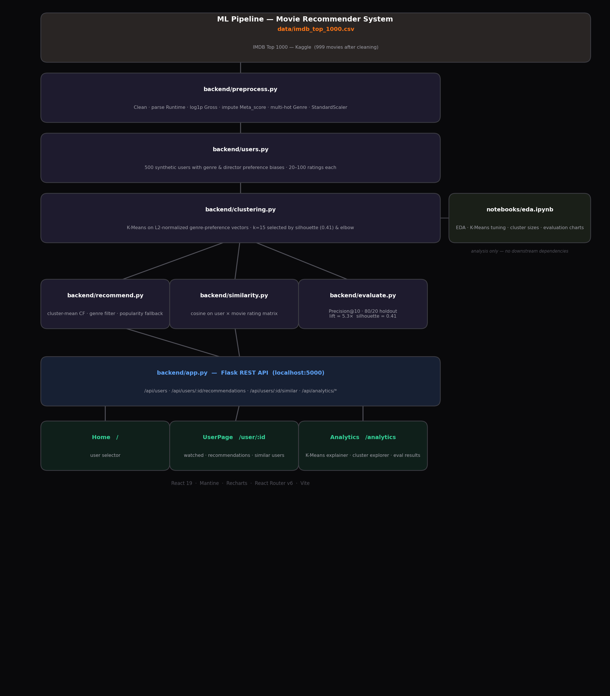

# Letterboxd Movie Recommendation System

**WGU C964, Computer Science Capstone, Task 2**
Student: João Vítor Fernandes (ID: 01062590) | Deadline: July 25, 2026

Letterboxd doesn't really do recommendations. You can log what you've watched and rate it, but there's no "movies for you" anywhere. This project is a proof-of-concept for what that could look like: cluster users by taste with K-Means, then recommend movies based on what similar users liked.

---

## Pipeline overview



---

## What's here

- Top-10 personalized recommendations per user, using collaborative filtering within K-Means clusters
- A "similar users" list based on cosine similarity over rating vectors
- An `/analytics` page that walks through the whole pipeline: K-Means tuning, cluster breakdowns, evaluation numbers
- A small Flask API serving everything from precomputed CSV/numpy files
- A React + Mantine frontend with a poster grid, pagination, and the analytics explainer

---

## Dataset

`data/imdb_top_1000.csv`, from [IMDB Top 1000 Movies (Kaggle)](https://www.kaggle.com/datasets/harshitshankhdhar/imdb-dataset-of-top-1000-movies-and-tv-shows)

999 movies after dropping the one TV series entry. There's no real Letterboxd data here. 500 synthetic users are generated, each with a couple of favorite genres/directors that bias what they watch and how they rate it, so the taste clusters actually mean something.

---

## How the ML side works

1. **Preprocessing**: parse runtime, clean up gross revenue (log1p, it's heavily skewed), fill in missing Meta_score, multi-hot encode genre, frequency-encode director/cast, then scale everything
2. **User feature vectors**: rating-weighted average of movie feature vectors per user
3. **K-Means clustering**: on L2-normalized genre-preference vectors; k=15 picked by silhouette/elbow (silhouette = 0.41)
4. **Collaborative filtering**: mean rating within the user's cluster, filtered down to their favorite genres
5. **Popularity fallback**: if a cluster is too sparse, just recommend the highest-rated movies they haven't seen
6. **User similarity**: cosine similarity over the user-movie rating matrix

**Cold start:** with only 20-100 ratings per synthetic user this never actually triggers, but for a brand-new user with very few ratings, collaborative filtering wouldn't have much to go on. A natural next step would be content-based filtering: representing each film as a feature vector (genre, director, cast, runtime, score) and recommending similar films via cosine similarity.

---

## Evaluation

| Metric | Result | Target |
|---|---|---|
| Silhouette coefficient | 0.41 | ≥ 0.40 |
| Precision@10 (model) | 0.070 | n/a |
| Precision@10 (baseline) | 0.013 | n/a |
| Lift over baseline | 5.3x | > 1x |

Precision@10 looks low in absolute terms, but that's mostly the dataset. With only 999 movies and ~12 held-out items per user, even a near-perfect recommender is competing against a huge candidate pool. What matters more is the comparison: the model gets 5.3x the precision of just recommending whatever's most popular, so the clustering is clearly picking up real signal.

---

## Setup

Written for **Windows 10** using Command Prompt. macOS/Linux notes are called out where things differ.

### 1. Install prerequisites

- **Python 3.11+**: [python.org/downloads](https://www.python.org/downloads/). During install, check **"Add python.exe to PATH"** on the first screen, otherwise `python` won't work in a terminal.
- **Node.js 18+ (LTS)**: [nodejs.org](https://nodejs.org/). The installer adds `node` and `npm` to PATH automatically.
- **Git** (optional): [git-scm.com](https://git-scm.com/downloads), only needed if you're cloning instead of downloading a ZIP.

Check both are on PATH:

```bash
python --version
node --version
```

### 2. Get the code

Download this repo as a ZIP and extract it (or `git clone` it), then open Command Prompt and `cd` into the extracted folder:

```bash
cd C:\Users\<you>\Downloads\capstone
```

Everything below assumes you're in this folder.

### 3. Backend setup

```bash
python -m venv .venv
.venv\Scripts\activate
```

> macOS/Linux: use `python3 -m venv .venv` and `source .venv/bin/activate`

You should see `(.venv)` at the start of the line once it's active. Then install the Python dependencies:

```bash
pip install -r backend/requirements.txt
```

### 4. Run the data pipeline (one-time)

This builds the cleaned dataset, generates the synthetic users, runs the clustering, and precomputes recommendations + similarity. Basically everything the app needs to actually run. Run these **in order**, with the venv still active:

```bash
python backend/preprocess.py    # clean data + build feature matrix
python backend/users.py         # generate 500 synthetic users
python backend/clustering.py    # K-Means, saves cluster labels
python backend/recommend.py     # precompute recommendations
python backend/similarity.py    # precompute user similarities
```

Optional, prints the evaluation metrics (Precision@10, silhouette, etc.):

```bash
python backend/evaluate.py
```

### 5. Start the backend

```bash
python backend/app.py
```

Leaves the Flask API running at **http://localhost:5000**. Keep this terminal open.

### 6. Start the frontend

Open a **second** Command Prompt window, `cd` back into the project folder, then:

```bash
cd frontend
npm install
npm run dev
```

This serves the app at **http://localhost:3000**.

### 7. Use it

With both terminals still running, open **http://localhost:3000** in a browser, pick a user, and poke around: recommendations, watch history, similar users, and the `/analytics` page.

---

## API endpoints

| Method | Path | Description |
|---|---|---|
| GET | `/api/users` | List all user IDs |
| GET | `/api/users/:id/recommendations` | Top-10 recommendations |
| GET | `/api/users/:id/similar` | Top-10 similar users |
| GET | `/api/users/:id/watched` | Watched films with ratings |
| GET | `/api/movies/:id` | Movie detail |
| GET | `/api/analytics/overview` | Dataset stats + genre counts |
| GET | `/api/analytics/kmeans` | K-Means tuning results (k=2..20) |
| GET | `/api/analytics/clusters` | Cluster summaries |
| GET | `/api/analytics/clusters/:id` | Cluster users + top movies |

---

## Repo structure

```
├── data/
│   ├── imdb_top_1000.csv        # Raw dataset (Kaggle)
│   ├── movies_clean.csv         # Cleaned movie metadata
│   ├── movie_features.npy       # Scaled feature matrix (999 × 30)
│   ├── synthetic_users.csv      # Ratings + cluster labels + timestamps
│   ├── user_vectors.npy         # Per-user weighted feature vectors
│   ├── user_genre_vectors.npy   # L2-normalized genre preference vectors
│   ├── cluster_labels.npy       # K-Means cluster assignment per user
│   ├── rating_matrix.npy        # Sparse user × movie rating matrix
│   ├── recommendations.csv      # Precomputed top-10 recs per user
│   ├── user_similarity.csv      # Pairwise cosine similarity scores
│   └── *.png                    # EDA chart exports
├── notebooks/
│   └── eda.ipynb                # EDA, elbow plot, evaluation charts
├── backend/
│   ├── preprocess.py            # Cleaning + feature engineering
│   ├── users.py                 # Synthetic user generation
│   ├── clustering.py            # K-Means tuning + fitting
│   ├── recommend.py             # Hybrid recommendation pipeline
│   ├── similarity.py            # Cosine user similarity
│   ├── evaluate.py              # Holdout evaluation (Precision@10)
│   ├── app.py                   # Flask REST API
│   └── requirements.txt
├── frontend/
│   ├── index.html
│   ├── vite.config.js
│   └── src/
│       ├── App.jsx              # MantineProvider + routes
│       ├── index.css
│       ├── index.jsx
│       ├── pages/
│       │   ├── Home.jsx         # User selector landing page
│       │   ├── UserPage.jsx     # Watched · Recs · Similar users
│       │   └── Analytics.jsx    # ML explainer + cluster explorer
│       ├── components/
│       │   ├── UserSelector.jsx
│       │   ├── WatchedMovies.jsx
│       │   ├── MovieCard.jsx
│       │   ├── Recommendations.jsx
│       │   └── SimilarUsers.jsx
│       └── utils/
│           ├── fakeName.js      # Deterministic silly names for users
│           └── avatar.js
├── PLANNING.md
└── README.md
```

---

## References

- Gomez-Uribe & Hunt (2016): Netflix recommender system, hybrid methods, cold start
- Koren, Bell & Volinsky (2009): matrix factorization / latent factor models
- Sarwar et al. (2001): item-based CF, scalability, precomputation
- Russell & Norvig (2020): AI: A Modern Approach (K-Means background)
